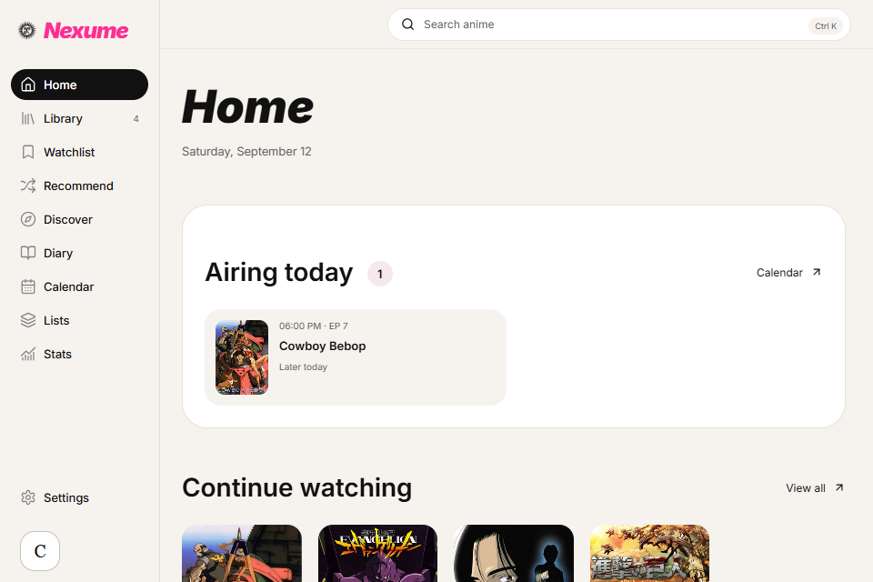

# Nexume

**Your anime, remembered.**

Nexume is a Windows desktop application that brings your anime collection, viewing progress, and personal impressions together. Keep track of what you are watching, organize what comes next, and revisit the stories you have finished through a visual library built around your own experience.

Your collection is saved locally on your computer. No account is required to manage your library, and online discovery connects to AniList for anime metadata and airing schedules.

[Download for Windows](https://github.com/Hakaelll/Nexume/releases) · [Release notes](docs/RELEASE-0.9.0.md) · [Development](#development)


## What you can do

### Build a collection that feels personal

Browse your anime in an interactive 3D collection, a poster grid, or a compact table. Search, filter, and sort your library to find a specific title or explore your collection from a different perspective.

- Track titles as **Planning, Watching, Completed, Paused, Dropped, or Rewatching**.
- Update episode progress and record rewatches.
- Add ratings, likes, favorites, personal tags, and private notes.
- Write quick thoughts or full reviews, with spoiler labels and visibility settings.
- Create custom lists with descriptions, cover images, and ranked ordering.
- Customize your local profile with an avatar, a bio, and favorite anime.

### Decide what to watch next

**For you** offers deterministic recommendations from your favorites, likes and ratings of at least 8/10. Hide proposals you do not want and restore them in Settings. Local search, light/dark/system themes and Spanish/English preferences work with your existing collection.

**Home** brings ongoing titles into a Continue watching shelf and highlights anime with aired episodes left to watch. Your **Watchlist** keeps planned titles organized with genre filters and priorities.

When you have a limited amount of time, **What fits tonight?** finds titles in your collection that fit your available minutes, based on episode duration and known aired episodes. Choose whether to continue a series or start something new, browse the matching titles, or let the animated picker choose one.

For broader discovery, **Recommend** offers random selections from your watchlist, library, online popular results, or the sample catalog, with filters such as genre, format, year, and episode count.

### Discover anime and follow the season

Search AniList and explore anime details, synopses, genres, studios, and community scores. Browse current and upcoming seasons, add individual titles to your watchlist, or add an entire season while preserving existing library entries.

The **Calendar** displays announced episodes for titles in your collection using your computer's timezone. Airing times describe the broadcast schedule; availability on streaming services can differ.

### Look back at your viewing history

The **Diary** records your activity as you update progress, ratings, and viewing status. **Stats** summarizes your collection with viewing totals, status breakdowns, monthly activity, rating distributions, and genre, studio, and release-period charts.

### Keep your data portable

Export a **JSON backup** of your library, ratings, reviews, lists, and profile. Restore it by merging with your current collection or replacing it after previewing the backup's contents. Before restoring, Nexume asks you to save a backup of the current collection.

You can also export your library as **CSV** for use in a spreadsheet or other tools.

<details>
<summary>More screenshots</summary>

**Home**



**Anime details**


**Statistics**


</details>

## Getting started

1. Open [GitHub Releases](https://github.com/Hakaelll/Nexume/releases) and download the Windows x64 setup executable from the release you want to install.
2. Run the installer, then launch Nexume.
3. Search for an anime or browse **Discover**, then add a title to your **Watchlist**.
4. Start watching and update your episode progress, rating, and thoughts from the title's details.
5. Use **Settings → Data & backups** to export a backup of your collection.

Nexume targets **Windows 10 and 11, x64**, and requires **Microsoft Edge WebView2**. The installer offers English and Spanish language options. Current builds are unsigned.

Internet access is needed for AniList searches, metadata refreshes, new artwork downloads, and updated airing information. Your saved collection and personal tracking remain available offline; cached artwork and schedule information depend on what has already been downloaded.

## Local storage and optional sharing

The desktop application stores your personal collection in **SQLite** on your computer. Browser previews use separate browser storage and do not share the installed application's database.

Optional sharing supports publishing selected **profiles, lists, and reviews** through Supabase and a separate public viewer. It requires a configured backend, a viewer URL, and sign-in. Sharing publishes selected snapshots; it does not provide a full cloud backup or synchronize your entire library between devices. Private notes and watch history are excluded from published content.

Local collection features work without Supabase configuration. See [Optional social publishing](SOCIAL_ARCHITECTURE.md) for the publication model and [the Supabase schema](supabase/schema.sql) for backend setup.

## Development

Nexume uses **Tauri 2 and Rust** for the desktop application, **React, TypeScript, Zustand, and Vite** for the interface, **SQLite** for local persistence, and **Three.js** for the spatial collection.

### Requirements

- Node.js 22.18 or later and pnpm.
- Rust with the MSVC toolchain.
- Visual Studio C++ Build Tools and the Windows SDK for native Windows builds.
- Microsoft Edge WebView2 for the desktop runtime.

### Run locally

```sh
git clone https://github.com/Hakaelll/Nexume.git
cd Nexume
pnpm install --frozen-lockfile
```

Start the browser preview:

```sh
pnpm dev
```

Start the desktop application in development mode:

```sh
pnpm tauri dev
```

### Validate and build

```sh
pnpm lint
pnpm typecheck
pnpm test
pnpm build
pnpm tauri build
```

The native build produces a Windows NSIS installer under `src-tauri/target/release/bundle/nsis/`.

### Configure optional sharing

Copy [`.env.example`](.env.example) to `.env.local` and set `VITE_SUPABASE_URL`, `VITE_SUPABASE_ANON_KEY`, and `VITE_PUBLIC_VIEWER_URL` for your own Supabase project and public viewer deployment. Apply the repository's [Supabase schema](supabase/schema.sql) and review the [sharing architecture](SOCIAL_ARCHITECTURE.md) before enabling publication.

Only use a public/anon key in frontend configuration. Never include a Supabase service-role key.

## Project documentation

- [Architecture](ARCHITECTURE.md) — application structure and data boundaries.
- [Database](DATABASE.md) — local persistence and data model.
- [3D collection](COLLECTION_3D.md) — spatial layout and rendering.
- [Optional sharing](SOCIAL_ARCHITECTURE.md) — public snapshots and privacy rules.
- [Performance review](docs/PERFORMANCE-REVIEW.md) — version 0.8.1 optimizations and measurements.
- [Assets and attribution](docs/ASSETS.md) — artwork sources, fonts, and icon credits.

Anime metadata and online artwork are provided through AniList. Anime artwork and descriptions belong to their respective rights holders; see the asset documentation for sample-catalog attribution.
