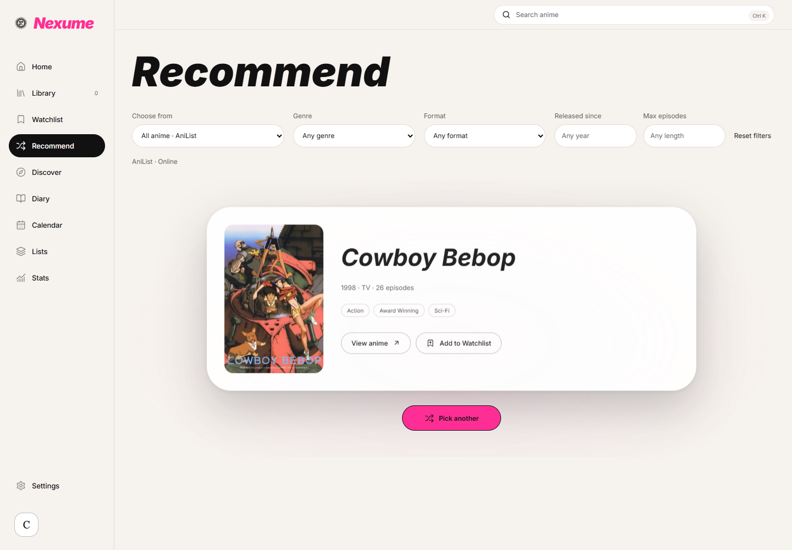
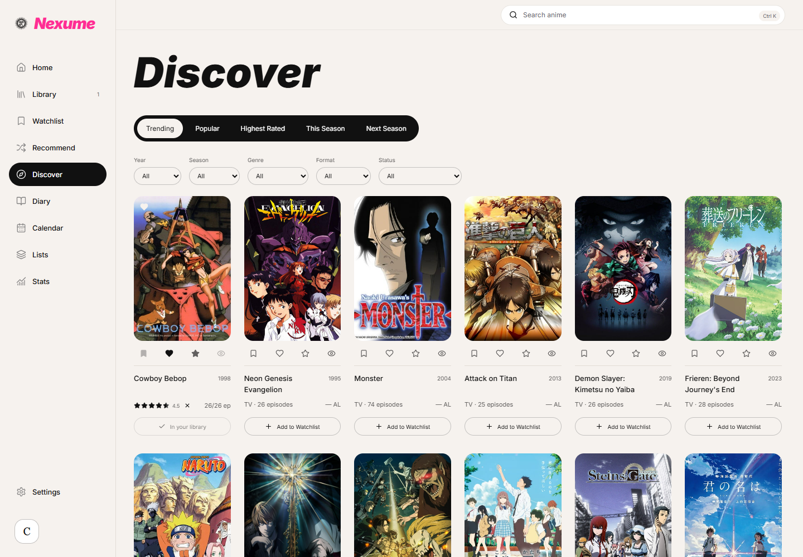
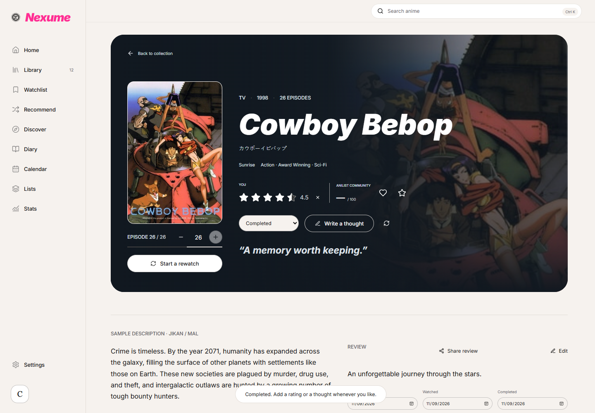
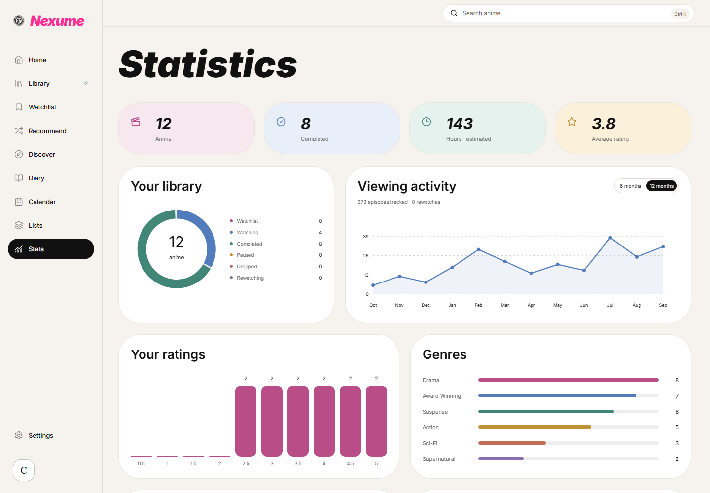
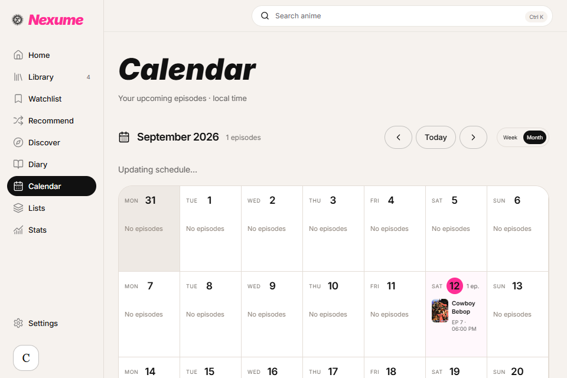
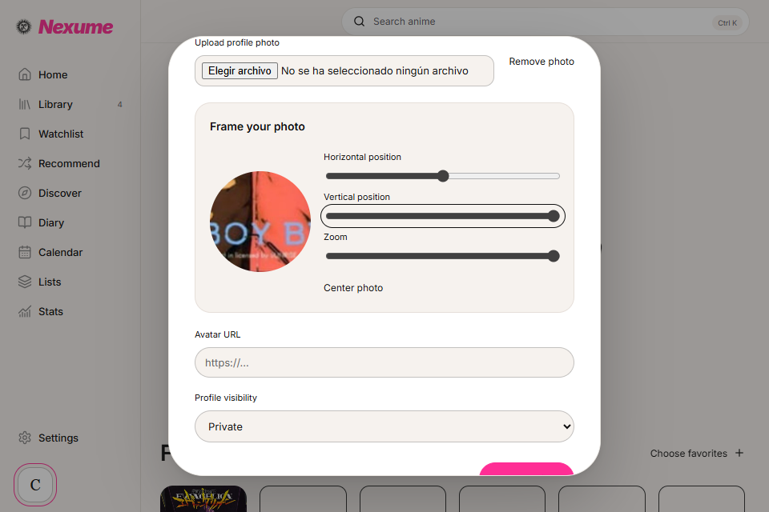

# Nexume

### Tu anime, tus recuerdos.

Nexume es una aplicación de escritorio para Windows que convierte tu historial de anime en una colección personal. Organiza lo que quieres ver, registra episodios, puntúa tus series y películas y conserva tus impresiones en un espacio propio.

**Sin cuenta obligatoria. Datos locales. Compartir es opcional.**



## Una colección que apetece abrir

- **Biblioteca en tres vistas:** colección espacial con Three.js, cuadrícula de portadas y tabla configurable.
- **Acciones rápidas:** añade a Watchlist, da me gusta, puntúa con medias estrellas y marca como visto desde las tarjetas, sin abrir la ficha. Las notas y los cambios de estado se integran en el diario.
- **Seguimiento:** progreso por episodios, estados de visionado, revisiones, favoritos independientes de los me gusta y prioridades de Watchlist.
- **Descubrimiento:** búsqueda en AniList con sugerencias y teclado, filtros y exploración por temporada, popularidad o tendencias.
- **Anime aleatorio:** elige desde Watchlist, tu biblioteca, una muestra sin conexión o todo el catálogo de AniList, con filtros de género, formato, año y duración y una ruleta de portadas que frena sobre el resultado.
- **Perfil personal:** carga una foto JPG, PNG o WebP desde tu equipo, previsualízala o usa una URL. La imagen se recorta al centro y se guarda localmente a 256 × 256 píxeles.
- **Fichas panorámicas:** imagen de fondo visible, degradado de lectura y controles de seguimiento integrados.
- **Tu memoria de anime:** reseñas con control de spoilers, pensamientos breves, listas ordenadas, perfil, calendario y estadísticas.
- **Diseño editorial:** fondo crema, titulares Inter en negrita cursiva, tarjetas suaves, portadas en color y acciones en magenta. Animaciones compatibles con movimiento reducido.
- **Copias de seguridad:** exportación JSON y CSV, restauración validada y combinación de colecciones.



Nexume es un organizador de anime; no reproduce ni descarga episodios.

## Probar en Windows

La versión de prueba actual es **0.6.0**, para Windows 10/11 de 64 bits. Los paquetes generados localmente están en `release/`:

| Archivo | Uso |
| --- | --- |
| `Nexume-0.6.0-windows-x64-setup.exe` | Instalador para el usuario actual |
| `Nexume-0.6.0-windows-x64.exe` | Ejecutable sin instalación; necesita WebView2 |
| `SHA256SUMS-0.6.0.txt` | Huellas SHA-256 de ambos paquetes |

La carpeta `release/` no se versiona en Git. Estos archivos deben adjuntarse a una publicación de GitHub Releases para distribuirlos; todavía no hay una publicación creada por este cambio. Los paquetes de desarrollo no están firmados. La interfaz de la aplicación está en inglés; el instalador permite español e inglés.

Empieza con **Add anime**, usa el buscador superior o pulsa **Try a sample** para cargar 12 animes con progreso y notas de ejemplo. La muestra es opcional y conserva las entradas existentes.

## Cómo funciona el sorteo

En **Recommend → Choose from**, selecciona **All anime · AniList** para descubrir títulos fuera de los resultados populares. Cada tirada toma una nueva muestra de identificadores de todo el rango del catálogo, aplica los filtros y elige un candidato al azar. No descarga la base de datos completa ni usa IA.

Los filtros muy restrictivos pueden dejar una tirada sin coincidencias: vuelve a intentar o amplía los filtros. Esto no significa que no existan animes que cumplan esos criterios. El acceso al catálogo requiere conexión y depende de la disponibilidad y los límites de AniList. Watchlist, Library y Sample catalog permiten sorteos locales.

## Datos y privacidad

La aplicación Windows guarda tu colección en SQLite (`nexume.db`) bajo `%APPDATA%/app.nexume.desktop`. Las imágenes se almacenan en una caché separada. La versión del navegador usa almacenamiento local: **las colecciones del navegador y de Windows son independientes**. Puedes transferirlas mediante un backup JSON.

Los fallos de lectura o guardado se muestran sin reiniciar silenciosamente tu colección. Restaurar una copia valida su estructura, ofrece combinar o reemplazar y solicita una copia previa. Los backups no incluyen sesiones, propiedad de publicaciones ni subidas pendientes. Restaurar no publica contenido automáticamente.

## Desarrollo

Stack: **Tauri 2 · Rust · React 19 · TypeScript · Zustand · SQLite · Three.js · Vite**. Metadatos de AniList; Supabase solo para compartir opcionalmente.

Requisitos: Node.js 22.18 o superior, pnpm, Rust estable con MSVC, Visual Studio C++ Build Tools, Windows SDK y Microsoft Edge WebView2.

```powershell
corepack pnpm install --frozen-lockfile
npm run dev
```

La vista web se abre en `http://127.0.0.1:1420`. Para ejecutar la aplicación nativa:

```powershell
npm run tauri dev
```

Validación y compilación:

```powershell
npm run lint
npm run typecheck
npm test
npm run test:e2e
npm run build
npm run tauri build
```

Playwright utiliza Microsoft Edge instalado. Las pruebas de catálogo usan respuestas controladas y las de privacidad ejecutan el esquema PostgreSQL real mediante PGlite. Los resultados y límites de la verificación se documentan en [VERIFICATION.md](docs/VERIFICATION.md).

## Compartir opcionalmente

1. Crea un proyecto Supabase y aplica `supabase/schema.sql`.
2. Copia `.env.example` a `.env.local` y configura `VITE_SUPABASE_URL`, `VITE_SUPABASE_ANON_KEY` y `VITE_PUBLIC_VIEWER_URL`.
3. Usa como URL del visor tu dirección HTTPS real, terminada en `viewer.html`, y compila la aplicación con esos valores.
4. Aloja `dist/` en un servidor estático e inicia sesión desde Settings.
5. Elige la visibilidad de una lista, perfil o reseña y publícala explícitamente.

El frontend solo debe contener una clave pública/anon. Las notas privadas, rutas del dispositivo e historial no forman parte de los datos públicos. Las publicaciones Unlisted son accesibles a quien tenga el enlace; no tienen contraseña. Sin configuración, todas las funciones locales siguen disponibles.

## Atajos

| Acción | Atajo |
| --- | --- |
| Buscar anime | Ctrl+K |
| Biblioteca / Inicio / Ajustes | Ctrl+L / Ctrl+H / Ctrl+, |
| Mover selección en Collection | Flechas o rueda |
| Abrir ficha / Vista rápida en Collection | Enter / Espacio |
| Cerrar o volver | Escape |
| Me gusta / Puntuar en la ficha | F / R |
| Ajustar una puntuación enfocada | Flechas, Inicio, Fin; Supr para borrar |

## Documentación y créditos

- [Arquitectura](ARCHITECTURE.md) y [base de datos](DATABASE.md)
- [Colección 3D](COLLECTION_3D.md) y [compartir](SOCIAL_ARCHITECTURE.md)
- [Diseño](DESIGN.md) y [cambios visuales 0.6.0](docs/GALLERY_REVAMP.md)
- [Atribución de imágenes y fuentes](docs/ASSETS.md)

Las portadas y los metadatos pertenecen a sus titulares y se obtienen de AniList. El emblema de Nexume procede de los recursos proporcionados para el proyecto. Inter se distribuye localmente, incluidos sus pesos en cursiva, siguiendo la referencia Playful. Android e iOS quedan fuera de esta versión.

## Novedades de 0.6.0

- **Animaciones configurables:** en Settings → Animations puedes seguir Windows, activar todas las animaciones o reducir el movimiento. El ajuste se aplica a Collection, ruleta y cambios de pantalla.
- **Perfil:** buscador al elegir favoritos, avatar más grande y encuadre de fotos con posición horizontal, vertical y zoom.
- **Calendario:** vistas semanal y mensual, navegación entre periodos, día actual destacado y episodios con horario local. Consulta las emisiones de los animes de Watching, Rewatching y Watchlist. Sin conexión conserva las fechas conocidas.
- **Home:** emisiones del día, animes que estás viendo, temporada y recomendaciones basadas en géneros y puntuaciones.
- **Diary:** resumen de actividad y tarjetas con acentos según el tipo de evento.
- **Discover:** filtros de nota mínima, máximo de episodios, título y ordenación.

Los horarios completos y el catálogo dependen de AniList. El ordenador de destino puede tener una configuración de accesibilidad distinta: selecciona **Full animations** si quieres activar las animaciones dentro de Nexume aunque Windows solicite reducir movimiento.

Las portadas priorizan la resolución original disponible, incluso para animes guardados. Los fondos usan banners panorámicos y evitan ampliar una portada vertical a toda la ficha. Las estrellas de la ficha aumentan a 24 píxeles, conservando las medias estrellas y los atajos de teclado.

Ruleta visual de portadas, colección con fondo claro y controles laterales separados del borde, búsqueda por relevancia, fichas con imagen panorámica y estadísticas con color. En **Profile → Edit profile → Upload profile photo** puedes elegir una foto local (JPG, PNG o WebP, hasta 10 MB), previsualizarla y guardarla.






